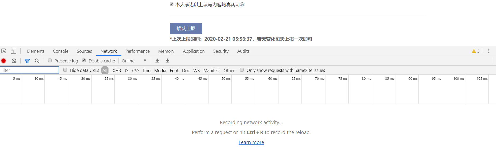
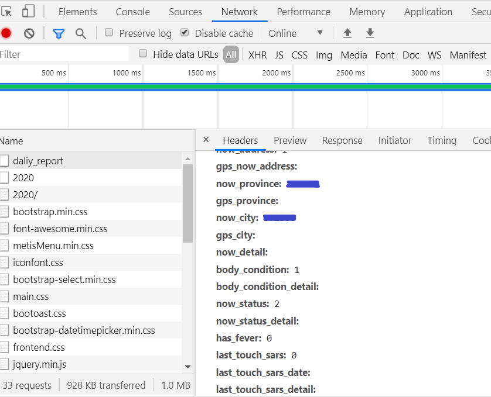

# USTC-Auto-Health-Report
## 中科大健康打卡平台自动打卡脚本-电报反馈结果

**本打卡脚本仅供学习交流使用，请勿过分依赖。开发者对使用或不使用本脚本造成的问题不负任何责任，不对脚本执行效果做出任何担保，原则上不提供任何形式的技术支持。**

本项目来源于不知道愿不愿意透露姓名的已经下架的同名项目（愿意请联系我写上原作者），稍加修改适应了3月30日增加宿舍号后的系统，并加入了电报机器人自动反馈打卡与报备结果。使用方法部分参考了[中国滑稽大学(University of Ridiculous of China)健康打卡平台自动打卡脚本](https://github.com/Kobe972/USTC-ncov-AutoReport)。

目前贵科晚上20:00之后打卡可以选择报备到第二天，但我不会，所以现在这里不提供。

- [x] 统一身份认证登录
    - [x] 验证码绕过
    - [ ] 验证码识别（能绕过为什么要识别？）
    
- [x] 健康打卡
- [x] 进出校申请


# 环境

python==3.9

见requirements.txt

# 使用方法

## 运行测试

要在本地运行测试，需要安装python 3。我们假设您已经安装了python 3和pip 3，并已将其路径添加到环境变量。

### 安装依赖

```shell
pip install -r requirements.txt
```
### 修改个人信息

1. 在apply.json中，第3行return——college那里改为自己要出入的校区，默认为东西南中，没带北，要去掉校区就删，要加注意顺序。

2. 在main.py中，第4行括号内的0, 300是随机延迟0到5分钟，可以修改来延迟随机时间。
第8行输入自己的学号和密码，统一身份认证的那个，不要删单引号。

3. 在post.json中修改自己的宿舍、紧急联系人等信息，数据获取方法请见下面post.json 数据获取方法。不要删双引号。

### 配置Telegram机器人

0. 这是为了在telegram中自动反馈你有没有打卡和报备成功，如果不需要，请把ustc_auto_report.py中的第7、8、9、67、68、69、70、114、115、116、117行删掉。

1. 请确保自己运行脚本的终端能够科学上网，比如Mac版Clash X Pro开启Enhanced Mode，Windows cmd中
    ```shell
    set http_proxy=http://127.0.0.1:xxxx
    set https_proxy=http://127.0.0.1:xxxx
    ```
    之类的，不具体说了，自行百度亿下。

2. 去认领一个Telegram机器人并记住它的token，具体方法可以看看这个https://core.telegram.org/bots#6-botfather 。去开一个Telegram频道，获取它的id，或者想私信收到的话就获取你自己的聊天id，方法很多可以百度亿下。需要注意的是频道要把你的bot添加为管理员，私信的话你需要先给你的bot发个/start它才能给你发私信。

3. 替换ustc_auto_report.py第7、8行为你的频道、个人id信息和机器人token。可选：替换68、70、115、117行的text部分为你想要的提醒文字。

### 运行打卡程序

```shell
python main.py
```

### 定时打卡

本地运行的话自己设置Crontab、Launchd之类的方法来定时运行吧，要注意的是Crontab在Mac睡眠时是不会运行的，Launchd也需要先把电脑唤醒才行。也可以参考[中国滑稽大学(University of Ridiculous of China)健康打卡平台自动打卡脚本](https://github.com/Kobe972/USTC-ncov-AutoReport)里利用GitHub服务器定时打卡的方法。

## post.json 数据获取方法

使用 F12 开发者工具抓包之后得到数据，按照 json 格式写入 `post.json` 中。

1. 登录进入 `https://weixine.歪比巴卜.edu.cn/2020/`，打开开发者工具（Chrome 可以使用 F12 快捷键），选中 Network 窗口：



2. 点击确认上报，点击抓到的 `daliy_report` 请求，在`PHeaders`或者 `Payload`下面找到 `Form Data` 这就是每次上报提交的信息参数。



3. 将找到的 Data 除 `_token` （每次都会改变，所以不需要复制，脚本中会每次获取新的 token 并添加到要提交的数据中）外都复制下来，存放在 `post.json` 中，并参考示例文件转换为对应的格式。


## 许可

MIT License

Copyright (c) 2020 BwZhang

Copyright (c) 2020 Violin Wang

Copyright (c) 2021 Eric Fan

Copyright (c) 2022 fzm1011

Permission is hereby granted, free of charge, to any person obtaining a copy
of this software and associated documentation files (the "Software"), to deal
in the Software without restriction, including without limitation the rights
to use, copy, modify, merge, publish, distribute, sublicense, and/or sell
copies of the Software, and to permit persons to whom the Software is
furnished to do so, subject to the following conditions:

The above copyright notice and this permission notice shall be included in all
copies or substantial portions of the Software.

THE SOFTWARE IS PROVIDED "AS IS", WITHOUT WARRANTY OF ANY KIND, EXPRESS OR
IMPLIED, INCLUDING BUT NOT LIMITED TO THE WARRANTIES OF MERCHANTABILITY,
FITNESS FOR A PARTICULAR PURPOSE AND NONINFRINGEMENT. IN NO EVENT SHALL THE
AUTHORS OR COPYRIGHT HOLDERS BE LIABLE FOR ANY CLAIM, DAMAGES OR OTHER
LIABILITY, WHETHER IN AN ACTION OF CONTRACT, TORT OR OTHERWISE, ARISING FROM,
OUT OF OR IN CONNECTION WITH THE SOFTWARE OR THE USE OR OTHER DEALINGS IN THE
SOFTWARE.


