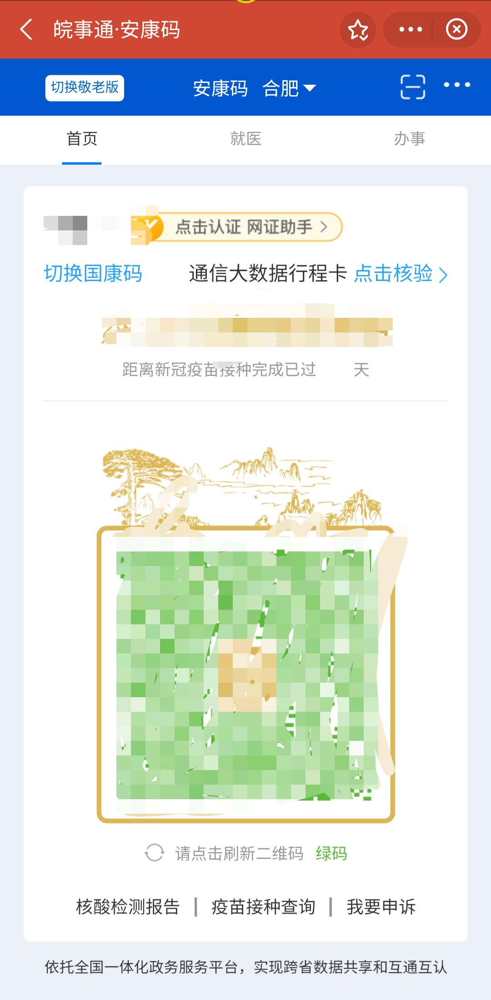
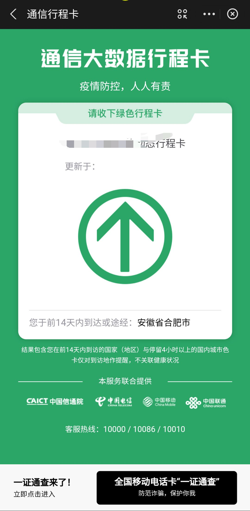

# USTC-Auto-Health-Report
## 中科大健康打卡平台自动打卡/报备/两码脚本-电报反馈结果

**本打卡脚本仅供学习交流使用，请勿过分依赖。开发者对使用或不使用本脚本造成的问题不负任何责任，不对脚本执行效果做出任何担保，原则上不提供任何形式的技术支持。** ~~毕竟小孩子不懂事乱写的~~

本项目来源于不知道愿不愿意透露姓名的已经下架的同名项目（愿意请联系我写上原作者），稍加修改适应了新的系统且持续更新，并加入了电报机器人自动反馈打卡与报备结果。使用方法部分参考了[中国滑稽大学(University of Ridiculous of China)健康打卡平台自动打卡脚本](https://github.com/Kobe972/USTC-ncov-AutoReport)。

生成两码的部分参考了[USTC健康打卡平台自动打卡脚本](https://github.com/cyzkrau/AutoDailyReport-For-USTC)并略作改进。具体是指对安康码时间字体加粗，两码生成时间略微错开，安康码增加疫苗接种天数，以及修改生成图片的文件名使更加真实。不建议使用这个功能，写出来就当python入门了。至于为什么不劫持安康码json做信安大作业，因为那虽然更加真实但是真的太刑了。

# 更新日志

2022年4月28日更新

- 增加自动生成两码和上传的功能（默认不开启，需要请往下阅读）

2022年4月5日更新

- 增加了前一天晚上打卡到第二天的支持

2022年4月5日更新

- 修复了因需要写原因报备失败的问题

2022年3月30日更新

- 修复了因需要填写宿舍信息打卡失败的问题


# 应用功能

- [x] 统一身份认证登录
    - [x] 验证码绕过
    - [ ] 验证码识别（能绕过为什么要识别？）
    
- [x] 健康打卡

- [x] 自动生成和上传两码（太刑了，非常可铐）

- [x] 进出校申请（还能前一天晚上申请）

- [x] 随机延迟，模仿真人操作

# 环境

python==3.9

见requirements.txt

# 使用方法

## 运行测试

要在本地运行测试，需要安装python 3。我们假设您已经安装了python 3和pip 3，并已将其路径添加到环境变量。

### 安装依赖

```shell
pip install -r requirements.txt
```
### 修改个人信息

1. 在apply.json中，第3行return——college那里改为自己要出入的校区，默认为东西南中，没带北，要去掉校区就删，要加注意顺序。
第四行写自己的申请原因，不要删双引号。

2. 在main.py中，第4行括号内的0, 300是随机延迟0到5分钟，可以修改来延迟随机时间。
第8行输入自己的学号和密码，统一身份认证的那个，不要删单引号。

3. 在post.json中修改自己的宿舍、紧急联系人等信息，数据获取方法请见下面post.json 数据获取方法。不要删双引号。

### 选择自己要使用的功能（重要）

在main.py中，把自己不需要的功能注释掉或删掉。每个功能都注释过了。或者需要自动上传两码就把第11、12行取消注释。也可以更改4、12行的随机延迟时间以模拟真人或适应自己的网络。

### 配置Telegram机器人

0. 这是为了在telegram中自动反馈你有没有打卡和报备成功，如果不需要，请把ustc_auto_report.py中的第8-10、70-73、157-160、174-177行删掉，并且不用看下面三条了。

1. 请确保自己运行脚本的终端能够科学上网，比如Mac版Clash X Pro开启Enhanced Mode，Windows cmd中
    ```shell
    set http_proxy=http://127.0.0.1:xxxx
    set https_proxy=http://127.0.0.1:xxxx
    ```
    之类的，不具体说了，自行百度亿下。

2. 去认领一个Telegram机器人并记住它的token，具体方法可以看看这个https://core.telegram.org/bots#6-botfather 。去开一个Telegram频道，获取它的id，或者想私信收到的话就获取你自己的聊天id，方法很多可以百度亿下。需要注意的是频道要把你的bot添加为管理员，私信的话你需要先给你的bot发个/start它才能给你发私信。

3. 替换ustc_auto_report.py第8、9行为你的频道、个人id信息和机器人token。可选：替换71、73、158、160、175、177行的text部分为你想要的提醒文字。

### 生成两码

0. 注意：这个只是改时间，安康码的二维码是不改的，并且如果扫码会提示二维码已过期；行程卡的箭头大小也是不变的，总不可能每天截图都恰好是那个大小。虽然多数班级不查这个并且每天上传会覆盖前面的，但真查起来还是比较危险，慎用。需要的话去main.py把第11行前的#去掉，再把12行前的#去掉以给两码上传一定的时间，否则如果网不好下一步报备会失败。

1. 把自己的两码截图，记得把状态栏的时间截掉。用ps之类的软件把安康码的**时间**和**疫苗接种天数**抹掉，把行程卡的**时间**抹掉，生成类似我的实例图片，并另存为akm.jpg和xcm.jpg（名字和格式都别错）覆盖我原有的实例图片。


2. 去newtime.py里把第10行里的日期改成自己的接种日期。运行newtime.py
```shell
python newtime.py
```
   并检查新生成的Screenshot_Alipay.jpg和Screenshot_Wechat.jpg里三个数字的大小、位置是否合适，不合适就去newtime.py里改，都注释过了。反复调整直到比较真实为止。

### 运行打卡程序

```shell
python main.py
```

### 定时打卡

目前设置的时间是每天0：00到20：00申请到当天23:59:59，20:00到23:55是申请到第二天晚上23:59:59，不要在23:55之后的五分钟里运行这个脚本。本地运行时是获取的本地时间，如果放在服务器上运行要注意服务器时间，有的是UTC时间什么的，千万注意。如果需要使用两码功能，务必设置提前运行newtime.py。

本地运行的话自己设置Crontab、Launchd之类的方法来定时运行吧，要注意的是Crontab在Mac睡眠时是不会运行的，Launchd也需要先把电脑唤醒才行。也可以参考[中国滑稽大学(University of Ridiculous of China)健康打卡平台自动打卡脚本](https://github.com/Kobe972/USTC-ncov-AutoReport)里利用GitHub服务器定时打卡的方法。


## post.json 数据获取方法

使用 F12 开发者工具抓包之后得到数据，按照 json 格式写入 `post.json` 中。

1. 登录进入 `https://weixine.歪比巴卜.edu.cn/2020/`，打开开发者工具（Chrome 可以使用 F12 快捷键），选中 Network 窗口：


2. 点击确认上报，点击抓到的 `daliy_report` 请求，在`Headers`或者 `Payload`下面找到 `Form Data` 这就是每次上报提交的信息参数。


3. 将找到的 Data 除 `_token` （每次都会改变，所以不需要复制，脚本中会每次获取新的 token 并添加到要提交的数据中）外都复制下来，存放在 `post.json` 中，并参考示例文件转换为对应的格式。


## 许可

MIT License

Copyright (c) 2020 BwZhang

Copyright (c) 2020 Violin Wang

Copyright (c) 2021 Eric Fan

Copyright (c) 2022 fzm1011

Permission is hereby granted, free of charge, to any person obtaining a copy
of this software and associated documentation files (the "Software"), to deal
in the Software without restriction, including without limitation the rights
to use, copy, modify, merge, publish, distribute, sublicense, and/or sell
copies of the Software, and to permit persons to whom the Software is
furnished to do so, subject to the following conditions:

The above copyright notice and this permission notice shall be included in all
copies or substantial portions of the Software.

THE SOFTWARE IS PROVIDED "AS IS", WITHOUT WARRANTY OF ANY KIND, EXPRESS OR
IMPLIED, INCLUDING BUT NOT LIMITED TO THE WARRANTIES OF MERCHANTABILITY,
FITNESS FOR A PARTICULAR PURPOSE AND NONINFRINGEMENT. IN NO EVENT SHALL THE
AUTHORS OR COPYRIGHT HOLDERS BE LIABLE FOR ANY CLAIM, DAMAGES OR OTHER
LIABILITY, WHETHER IN AN ACTION OF CONTRACT, TORT OR OTHERWISE, ARISING FROM,
OUT OF OR IN CONNECTION WITH THE SOFTWARE OR THE USE OR OTHER DEALINGS IN THE
SOFTWARE.


